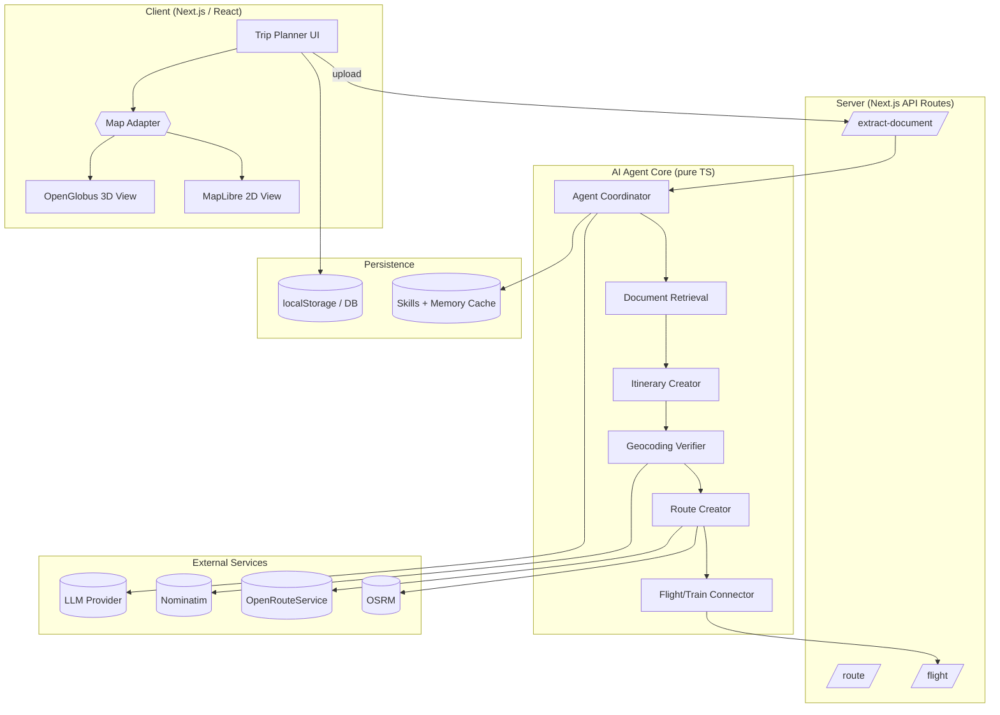
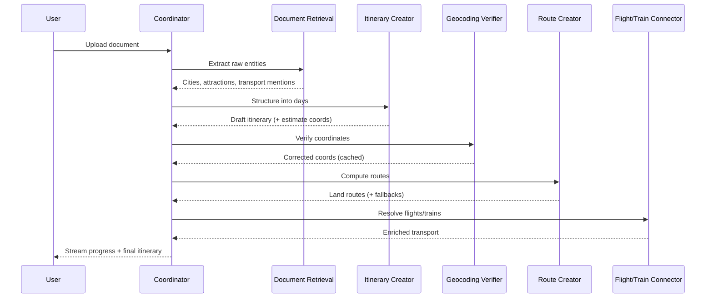
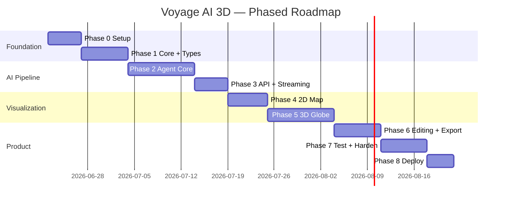
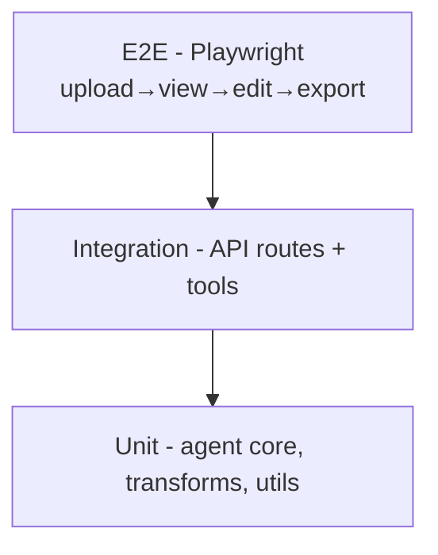

# Voyage AI 3D — Project Draft & Development Plan

**Document version:** 1.0
**Date:** 18 June 2026
**Author:** Engineering
**Status:** Draft for approval

---

## Table of Contents

1. [Executive Summary](#1-executive-summary)
2. [Project Vision & Goals](#2-project-vision--goals)
3. [Background & Lessons From the Prototype](#3-background--lessons-from-the-prototype)
4. [Scope](#4-scope)
5. [Target Users & Use Cases](#5-target-users--use-cases)
6. [Functional Requirements](#6-functional-requirements)
7. [Non-Functional Requirements](#7-non-functional-requirements)
8. [System Architecture](#8-system-architecture)
9. [Technology Stack](#9-technology-stack)
10. [Data Model](#10-data-model)
11. [AI Multi-Agent System Design](#11-ai-multi-agent-system-design)
12. [3D Mapping Integration (OpenGlobus)](#12-3d-mapping-integration-openglobus)
13. [Proposed Project Structure](#13-proposed-project-structure)
14. [Development Roadmap & Phases](#14-development-roadmap--phases)
15. [Detailed Task Breakdown](#15-detailed-task-breakdown)
16. [Environment & Setup Steps](#16-environment--setup-steps)
17. [Testing Strategy](#17-testing-strategy)
18. [Deployment & DevOps](#18-deployment--devops)
19. [Risks & Mitigations](#19-risks--mitigations)
20. [Timeline & Milestones](#20-timeline--milestones)
21. [Success Metrics & KPIs](#21-success-metrics--kpis)
22. [Future Enhancements](#22-future-enhancements)
23. [Appendix](#23-appendix)

---

## 1. Executive Summary

Voyage AI 3D is a ground-up rebuild of the existing AI trip-planning prototype. The prototype proved the core idea: upload a travel document, and a multi-agent AI pipeline extracts destinations, builds a day-by-day itinerary, resolves routes and flights, and visualizes everything on a map. The rebuild addresses the structural debt accumulated during rapid iteration and elevates the visualization from a 2D MapLibre map to an interactive **3D globe powered by [OpenGlobus](https://github.com/openglobus/openglobus)**.

The new project keeps the proven concepts — document extraction, the agent pipeline, geocoding verification, routing with fallbacks, and the skills/memory layer — but reorganizes them behind clean boundaries (rendering adapter, agent core, API services) so that the 2D and 3D map engines are interchangeable and the AI layer is independently testable.

**Key outcomes:**
- A maintainable, well-tested codebase with clear module boundaries.
- A 3D globe experience for itinerary overview, long-haul trips, terrain, and great-circle flight arcs.
- A retained 2D map for fast day-to-day editing.
- A provider-agnostic AI layer (OpenAI today, swappable later).

---

## 2. Project Vision & Goals

### 2.1 Vision

> Turn any travel document into a living, explorable 3D journey in seconds.

### 2.2 Primary Goals

| # | Goal | Definition of Success |
|---|------|----------------------|
| G1 | Accurate extraction | ≥ 90% of destinations correctly extracted and geolocated from a typical itinerary document |
| G2 | 3D visualization | Itinerary renders on an interactive globe with markers, routes, and flight arcs |
| G3 | Editing parity | Users can add/remove/reorder/insert stops and days with live map updates |
| G4 | Reliability | No hard dependency on any single external API; graceful fallbacks everywhere |
| G5 | Maintainability | Map engine is an adapter; AI layer is unit-testable without a browser |
| G6 | Exportability | Full itinerary (incl. flights & trains) exports to PDF/HTML/Text |

### 2.3 Non-Goals (for v1)

- Real-time booking / payments.
- Multi-user collaboration / live sharing.
- Native mobile apps (responsive web only).
- Offline-first / PWA installation.

---

## 3. Background & Lessons From the Prototype

The prototype (Next.js 16 + MapLibre + OpenAI) validated the product but surfaced recurring pain points worth designing away:

| Lesson | Prototype symptom | New-project response |
|--------|-------------------|----------------------|
| Map logic was entangled with trip state | Stale routes, duplicate React keys, manual route clearing | Map becomes a pure rendering adapter over derived state |
| Geocoding was LLM-dependent and error-prone | "Flame Mountain" placed in the USA | Dedicated geocoding service with country hints + centroid sanity checks |
| External APIs rate-limited or flaked | Gemini 429s, OSRM straight lines | Tool registry with availability checks and fallback chains |
| Export missed data | Flights absent from export | Export derives from a single normalized itinerary model |
| No automated tests | Regressions found manually | Test pyramid from day one |
| Provider lock-in | Hard migration Gemini → OpenAI | Provider-agnostic LLM client interface |

**Decision:** carry over *concepts and algorithms*, not the file structure. Start a clean repository.

---

## 4. Scope

### 4.1 In Scope (v1)

- Document upload & parsing: PDF, DOCX, images (vision), plain text.
- Multi-agent extraction → itinerary → routing → flight/train resolution.
- Geocoding verification with caching.
- 3D globe (OpenGlobus) **and** 2D map (MapLibre) with a toggle.
- Day-by-day editing: add, remove, reorder, **insert before/after**, swap days.
- Flights & trains with per-day display.
- Export to PDF / HTML / Text including transport details.
- Trip persistence (local first; pluggable to a database later).

### 4.2 Out of Scope (v1)

- Authentication & accounts (stub an interface; defer implementation).
- Server-side multi-tenant storage.
- Booking integrations.

---

## 5. Target Users & Use Cases

### 5.1 Personas

- **Tour operator / planner** — converts supplier itineraries into client-ready visual plans.
- **Independent traveler** — drops a booking confirmation and gets an explorable map.
- **Travel content creator** — wants attractive 3D flythroughs of a route.

### 5.2 Key Use Cases

1. **UC-1 Document to itinerary:** Upload a multi-day itinerary PDF → see a structured, mapped trip.
2. **UC-2 Manual refinement:** Insert a missed attraction between two stops; routes recalculate.
3. **UC-3 Overview vs detail:** Switch to globe for the whole trip, back to 2D to edit a single day.
4. **UC-4 Flights:** See great-circle arcs between airports with flight metadata.
5. **UC-5 Export:** Produce a shareable PDF including flights and trains.

---

## 6. Functional Requirements

| ID | Requirement | Priority |
|----|-------------|----------|
| FR-1 | Accept PDF, DOCX, image, and text uploads | Must |
| FR-2 | Extract destinations, cities, attractions, flights, trains | Must |
| FR-3 | Organize extraction into a day-by-day itinerary | Must |
| FR-4 | Verify & cache geocoded coordinates with country hints | Must |
| FR-5 | Compute road routes with ORS → OSRM → Haversine fallback | Must |
| FR-6 | Resolve flight/train metadata (airports, times, airlines) | Must |
| FR-7 | Render itinerary on a 3D globe (markers, routes, arcs) | Must |
| FR-8 | Render itinerary on a 2D map; toggle between 2D/3D | Must |
| FR-9 | Add / remove / reorder / insert / swap stops and days | Must |
| FR-10 | Stream pipeline progress to the UI (NDJSON) | Should |
| FR-11 | Export PDF / HTML / Text incl. transport | Must |
| FR-12 | Persist trips locally; load/save | Must |
| FR-13 | Filter by day and by location type | Should |
| FR-14 | Accommodation suggestions for overnight transitions | Could |
| FR-15 | Self-improving skills/memory cache for the agents | Could |

---

## 7. Non-Functional Requirements

| ID | Category | Requirement |
|----|----------|-------------|
| NFR-1 | Performance | First itinerary render < 3s after extraction completes (excl. LLM latency) |
| NFR-2 | Performance | Globe maintains ≥ 30 FPS for trips up to 200 stops on mid-range hardware |
| NFR-3 | Reliability | Every external API has a fallback or graceful degradation |
| NFR-4 | Security | API keys server-side only; never shipped to the client |
| NFR-5 | Accessibility | Keyboard navigation for sidebar & forms; WCAG AA color contrast |
| NFR-6 | Maintainability | ≥ 70% unit-test coverage on agent core and data transforms |
| NFR-7 | Portability | Runs on Node 20+; Dockerized for deployment |
| NFR-8 | Observability | Structured logs for each agent step; error tracking hook |

---

## 8. System Architecture

### 8.1 High-Level Diagram



### 8.2 Layered Boundaries

1. **Presentation layer** — React components, map adapter, view toggle.
2. **Application/API layer** — Next.js route handlers; thin controllers calling the core.
3. **Agent core** — framework-free TypeScript; no React, no `fetch` to the DOM; fully unit-testable.
4. **Tooling layer** — tool registry wrapping external services with availability + fallback.
5. **Persistence layer** — pluggable trip store + skills/memory cache.

The cardinal rule: **the agent core never imports anything browser-specific**, and **the map engines never own trip state** — they render derived props.

---

## 9. Technology Stack

| Concern | Choice | Rationale |
|---------|--------|-----------|
| Framework | Next.js (App Router) | SSR + API routes + mature ecosystem |
| Language | TypeScript (strict) | Type safety across core and UI |
| 3D map | `@openglobus/og` + `@openglobus/openglobus-react` | WebGL globe, terrain, React bindings |
| 2D map | MapLibre GL | Fast editing, proven in prototype |
| Styling | Tailwind CSS + shadcn/ui | Consistent, fast UI |
| LLM | OpenAI (provider-agnostic interface) | Current provider; swappable |
| Geocoding | Nominatim (OpenStreetMap) | Free, good coverage with hints |
| Routing | OpenRouteService → OSRM → Haversine | Layered fallback |
| Doc parsing | `unpdf` (PDF), `mammoth` (DOCX), LLM vision (images) | Server-safe, no worker issues |
| State | React state + lightweight store (Zustand or context) | Avoid prop drilling |
| Testing | Vitest + Testing Library + Playwright | Unit → integration → e2e |
| Packaging | Docker | Reproducible deploys |
| CI | GitHub Actions (or Harness) | Lint, test, build gates |

---

## 10. Data Model

The single normalized itinerary model is the source of truth for UI, both maps, and export.

```ts
type Coordinates = { lat: number; lng: number };

type LocationType =
  | "attraction" | "restaurant" | "hotel" | "landmark"
  | "city" | "airport" | "station" | "custom";

interface TripLocation {
  id: string;
  name: string;
  description?: string;
  address?: string;
  coordinates: Coordinates;
  type: LocationType;
  day: number;
  order: number;
}

interface RouteInfo {
  fromLocationId: string;
  toLocationId: string;
  coordinates: [number, number][]; // [lng, lat]
  distance: number;   // meters
  duration: number;   // seconds
  mode: "land" | "flight" | "train";
  isCrossDay?: boolean;
  fromDay?: number;
  toDay?: number;
}

interface FlightInfo {
  id: string;
  flightNumber: string;
  airline: string;
  departure: TransportEndpoint;
  arrival: TransportEndpoint;
  aircraft?: string;
  duration?: number;
  distance?: number;
  day: number;
}

interface TrainInfo {
  id: string;
  trainNumber: string;
  trainType: "high-speed" | "normal" | "metro" | "other";
  operator?: string;
  departure: TransportEndpoint;
  arrival: TransportEndpoint;
  duration?: number;
  distance?: number;
  day: number;
}

interface TransportEndpoint {
  name: string;        // airport/station name
  code?: string;       // IATA / station code
  city?: string;
  country?: string;
  coordinates: Coordinates;
  time?: string;       // HH:MM
}

interface Itinerary {
  id: string;
  name: string;
  days: number[];
  locations: TripLocation[];
  routes: RouteInfo[];
  flights: FlightInfo[];
  trains: TrainInfo[];
  createdAt: string;
  updatedAt: string;
}
```

**Design rule:** export, 2D map, and 3D map all derive their visuals from `Itinerary` — no engine-specific shadow state.

---

## 11. AI Multi-Agent System Design

### 11.1 Pipeline



### 11.2 Agents

| Agent | Input | Output | Tools |
|-------|-------|--------|-------|
| Document Retrieval | Raw text / image | Entities (places, transport) | `llm_chat`, `llm_vision` |
| Itinerary Creator | Entities | Draft day-by-day itinerary w/ estimate coords | `llm_chat`, `geocode_cache` |
| Geocoding Verifier | Draft itinerary | Verified coordinates | `nominatim_geocode`, `geocode_cache` |
| Route Creator | Verified itinerary | Routes per day + cross-day | `ors_route`, `osrm_route`, `haversine` |
| Flight/Train Connector | Itinerary + transport mentions | Enriched flights/trains | `airport_lookup`, `llm_chat` |

### 11.3 Cross-Cutting Subsystems

- **Tool Registry** — self-registering tools with `checkFn` availability, central `dispatch`, and `dispatchWithFallback` chains. Tools disable themselves temporarily on rate-limit (e.g., HTTP 429).
- **Skills (procedural memory)** — JSON-backed caches (geocoding results, route results, document patterns).
- **Memory** — agent notes + user profile, injected into prompts; updated by a post-run self-improvement step.
- **Provider abstraction** — `LLMClient` interface so OpenAI can be swapped without touching agents.

### 11.4 Geocoding Accuracy Controls

1. Country-code hint inferred from the cluster centroid of draft coordinates.
2. Country-constrained Nominatim query first, then unconstrained.
3. Sanity check: reject results too far (> ~40°) from the trip centroid.
4. Persist verified results to the geocode cache to avoid repeat lookups.

---

## 12. 3D Mapping Integration (OpenGlobus)

### 12.1 Adapter Contract

Both engines implement one interface so `TripPlanner` is engine-agnostic:

```ts
interface TripMapProps {
  itinerary: Itinerary;
  selectedLocationId?: string | null;
  visibleDays: Set<number>;
  visibleTypes: Set<string>;
  onLocationClick?: (id: string) => void;
  onVisibleDaysChange?: (days: Set<number>) => void;
}
```

- `TripMap2D` → MapLibre implementation.
- `TripMap3D` → OpenGlobus implementation.
- A `MapViewToggle` switches between them; trip state is unaffected.

### 12.2 Mapping Concepts

| Itinerary concept | OpenGlobus realization |
|-------------------|------------------------|
| `TripLocation` | Entity with billboard/label, colored by day |
| `RouteInfo` (land) | Polyline on terrain |
| Flight | True great-circle path (improves on 2D arc hack) |
| Day colors | Per-entity / per-polyline styling |
| `visibleDays` / `visibleTypes` | Entity collection visibility filters |
| Fit/Fly-to | Camera animation to bounding region |

### 12.3 Next.js Considerations

- WebGL is client-only → load via `dynamic(() => import("./TripMap3D"), { ssr: false })`.
- Lazy-load OpenGlobus to keep the initial bundle small.
- Simplify long route polylines before rendering to maintain frame rate.

### 12.4 Rollout Strategy

1. PoC: globe + markers + one route.
2. Add flights (great-circle) + day colors + filters.
3. Add click-to-select + camera fit/fly.
4. Reach feature parity, then expose the 2D/3D toggle by default.

---

## 13. Proposed Project Structure

```
voyage-ai-3d/
├── src/
│   ├── app/
│   │   ├── api/
│   │   │   ├── extract-document/route.ts
│   │   │   ├── route/route.ts
│   │   │   └── flight/route.ts
│   │   ├── layout.tsx
│   │   └── page.tsx
│   ├── components/
│   │   ├── trip-planner/
│   │   │   ├── TripPlanner.tsx
│   │   │   ├── TripStopsList.tsx
│   │   │   ├── ExportItinerary.tsx
│   │   │   ├── DocumentUpload.tsx
│   │   │   └── map/
│   │   │       ├── MapAdapter.tsx
│   │   │       ├── TripMap2D.tsx       # MapLibre
│   │   │       ├── TripMap3D.tsx       # OpenGlobus
│   │   │       └── MapViewToggle.tsx
│   │   └── ui/                         # shadcn primitives
│   ├── core/                           # framework-free agent core
│   │   ├── agents/
│   │   │   ├── coordinator.ts
│   │   │   ├── document-retrieval.ts
│   │   │   ├── itinerary-creator.ts
│   │   │   ├── geocoding-verifier.ts
│   │   │   ├── route-creator.ts
│   │   │   └── transport-connector.ts
│   │   ├── tools/                      # registry + tool impls
│   │   ├── skills/                     # procedural memory cache
│   │   ├── memory/                     # notes + profile
│   │   ├── llm/                        # provider-agnostic client
│   │   └── types.ts
│   ├── lib/                            # shared utils (haversine, parse-json)
│   └── types/trip.ts                   # normalized Itinerary model
├── tests/                             # vitest + playwright
├── docs/                              # this plan + ADRs
├── public/
├── Dockerfile
├── docker-compose.yml
├── .env.example
└── package.json
```

---

## 14. Development Roadmap & Phases



| Phase | Name | Goal | Exit Criteria |
|-------|------|------|---------------|
| 0 | Setup | Repo, tooling, CI skeleton | App builds; lint+test run in CI |
| 1 | Core foundations | Types, utils, LLM client, tool registry | Unit tests green for utils + registry |
| 2 | Agent core | Full pipeline framework-free | Pipeline produces an itinerary from sample text in tests |
| 3 | API + streaming | Wire core to Next.js routes; NDJSON progress | Upload returns streamed itinerary |
| 4 | 2D map | MapLibre adapter at parity with prototype | Markers, routes, flights, filters work |
| 5 | 3D globe | OpenGlobus adapter + toggle | Globe shows markers, routes, great-circle flights |
| 6 | Editing + export | Insert/reorder/swap; PDF/HTML/Text export incl. transport | Editing updates both maps; export complete |
| 7 | Test + harden | Coverage, error states, accessibility | ≥70% core coverage; e2e happy paths pass |
| 8 | Deploy | Dockerized deploy + observability | Live environment with logs/error tracking |

---

## 15. Detailed Task Breakdown

### Phase 0 — Setup
- [ ] Initialize repository, Next.js (TS strict), Tailwind, shadcn/ui.
- [ ] Configure ESLint, Prettier, `tsconfig` paths.
- [ ] Add Vitest + Testing Library + Playwright scaffolding.
- [ ] Add CI pipeline: install → lint → typecheck → test → build.
- [ ] Add `.env.example` and a config loader that fails fast on missing keys.

### Phase 1 — Core Foundations
- [ ] Define normalized `Itinerary` types in `types/trip.ts`.
- [ ] Implement shared utils: `haversine`, `parse-json`, id generation.
- [ ] Implement `LLMClient` interface + OpenAI adapter (text + vision).
- [ ] Implement Tool Registry: register, `dispatch`, `dispatchWithFallback`, availability, temporary disable on 429.
- [ ] Implement Skills store + Memory store (JSON-backed, injectable paths).
- [ ] Unit tests for registry, skills, memory, utils.

### Phase 2 — Agent Core
- [ ] Document Retrieval agent (text + vision) with prompt + parsing.
- [ ] Itinerary Creator agent (day structuring + estimate coords + cache lookup).
- [ ] Geocoding Verifier (country hint, constrained query, centroid sanity check, cache write).
- [ ] Route Creator (ORS → OSRM → Haversine fallback; per-day + cross-day).
- [ ] Transport Connector (airport lookup, flight/train enrichment, per-day assignment).
- [ ] Coordinator orchestration + post-run self-improvement.
- [ ] Golden-file tests using sample documents (text fixtures).

### Phase 3 — API & Streaming
- [ ] `/api/extract-document`: parse PDF/DOCX/image/text → run pipeline.
- [ ] NDJSON streaming of progress events to the client.
- [ ] `/api/route` and `/api/flight` thin handlers over core tools.
- [ ] Robust error envelope (typed errors → user-friendly messages).
- [ ] Integration tests hitting the route handlers.

### Phase 4 — 2D Map (MapLibre)
- [ ] `MapAdapter` interface + `TripMap2D`.
- [ ] Markers with day colors, type icons, labels.
- [ ] Land routes; flight arcs; day/type filters.
- [ ] Fit-bounds and select-on-click behavior.
- [ ] Component tests for derived-render logic.

### Phase 5 — 3D Globe (OpenGlobus)
- [ ] Install `@openglobus/og` + React bindings; client-only dynamic import.
- [ ] `TripMap3D`: entities for stops, polylines for routes.
- [ ] Great-circle flight paths.
- [ ] Day/type visibility filters; camera fit/fly-to.
- [ ] `MapViewToggle` (2D/3D) wired into `TripPlanner`.
- [ ] Performance pass: polyline simplification, lazy assets.

### Phase 6 — Editing & Export
- [ ] Add/remove/reorder stops; swap days; **insert before/after**.
- [ ] Live route recalculation (debounced) on edits.
- [ ] Export: PDF / HTML / Text including flights & trains, per-day sections.
- [ ] Trip persistence (local store) with load/save; pluggable DB interface.

### Phase 7 — Testing & Hardening
- [ ] Raise unit coverage on core ≥ 70%.
- [ ] e2e happy paths (upload → view → edit → export).
- [ ] Error/empty/loading states across UI.
- [ ] Accessibility audit (keyboard, contrast, ARIA).

### Phase 8 — Deployment
- [ ] Dockerfile + compose; production build.
- [ ] Structured logging + error tracking hook.
- [ ] Deploy to target environment; smoke tests.
- [ ] Write runbook + README.

---

## 16. Environment & Setup Steps

```bash
# 1. Scaffold
npx create-next-app@latest voyage-ai-3d --typescript --eslint --app --tailwind

# 2. Core dependencies
npm install maplibre-gl @openglobus/og @openglobus/openglobus-react \
            openai unpdf mammoth zustand lucide-react

# 3. Dev / test dependencies
npm install -D vitest @testing-library/react @testing-library/jest-dom \
              @playwright/test prettier

# 4. Environment
cp .env.example .env.local
# Fill in: OPENAI_API_KEY, OPENROUTESERVICE_API_KEY, API_NINJAS_KEY

# 5. Run
npm run dev      # http://localhost:3000
npm run test     # unit tests
npm run test:e2e # playwright
```

**Required environment variables**

| Variable | Purpose | Required |
|----------|---------|----------|
| `OPENAI_API_KEY` | LLM extraction & enrichment | Yes |
| `OPENROUTESERVICE_API_KEY` | Primary routing | Recommended |
| `API_NINJAS_KEY` | Airport lookups | Optional |

---

## 17. Testing Strategy



| Level | Scope | Tooling |
|-------|-------|---------|
| Unit | Agent core, tools, utils, data transforms | Vitest |
| Component | Map adapters' derived rendering, list/editing | Testing Library |
| Integration | API routes + tool registry + fallbacks | Vitest + mocked services |
| E2E | Full user journeys | Playwright |
| Golden files | Pipeline output vs sample documents | Vitest snapshots |

**Principles:** the agent core is testable without a browser; external services are mocked at the tool boundary; fallbacks have explicit tests (e.g., ORS down → OSRM → Haversine).

---

## 18. Deployment & DevOps

- **Containerization:** multi-stage Dockerfile; `docker-compose` for local parity.
- **CI gates:** lint → typecheck → unit/integration → build (block merge on failure).
- **CD:** build image → deploy to target (Cloud Run / container host).
- **Config:** secrets via environment, never committed; `.env.example` documents keys.
- **Observability:** structured per-agent logs, request IDs, and an error-tracking hook.
- **Rollback:** image tags per release; one-command rollback.

---

## 19. Risks & Mitigations

| Risk | Likelihood | Impact | Mitigation |
|------|-----------|--------|------------|
| OpenGlobus learning curve / API gaps | Medium | Medium | PoC first; keep 2D as fallback; isolate behind adapter |
| WebGL performance on large trips | Medium | Medium | Polyline simplification, entity batching, lazy loading |
| LLM cost / latency / rate limits | Medium | High | Caching via skills, provider abstraction, streaming UX |
| Geocoding ambiguity | Medium | High | Country hints + centroid sanity checks + cache |
| Routing API limits (ORS/OSRM) | High | Medium | Fallback chain + request throttling |
| Bundle size from two map engines | Medium | Low | Dynamic imports; load only the active engine |
| Next.js SSR vs WebGL | Medium | Medium | Strict client-only boundaries for 3D |
| Scope creep | Medium | Medium | Phase gates; defer non-goals to v2 |

---

## 20. Timeline & Milestones

Assuming a single focused developer; parallelization shortens calendar time.

| Milestone | Phases | Est. Duration | Cumulative |
|-----------|--------|---------------|------------|
| M1 — Foundations ready | 0–1 | ~2 weeks | Week 2 |
| M2 — Pipeline produces itineraries | 2–3 | ~3 weeks | Week 5 |
| M3 — 2D parity | 4 | ~1.5 weeks | Week 6.5 |
| M4 — 3D globe live | 5 | ~2 weeks | Week 8.5 |
| M5 — Editing + export complete | 6 | ~1.5 weeks | Week 10 |
| M6 — Hardened + deployed | 7–8 | ~2 weeks | Week 12 |

**Overall estimate:** ~12 weeks to a hardened v1 (solo). Add buffer for OpenGlobus exploration.

---

## 21. Success Metrics & KPIs

| KPI | Target |
|-----|--------|
| Extraction accuracy (destinations correctly geolocated) | ≥ 90% |
| Time from upload to rendered itinerary | < 30s typical document |
| Globe frame rate (≤ 200 stops) | ≥ 30 FPS |
| Core unit-test coverage | ≥ 70% |
| Export completeness (incl. flights/trains) | 100% of present data |
| External-API failure recovery | 100% via fallback/degradation |

---

## 22. Future Enhancements

- Authentication + cloud-synced trips (multi-device).
- Collaborative editing & shareable public links.
- Animated 3D flythrough / "cinematic tour" export (video).
- Booking & pricing integrations (flights, hotels).
- Offline/PWA mode.
- Additional providers (Anthropic/Gemini) behind the LLM interface.
- Terrain & 3D building layers for city-level detail.

---

## 23. Appendix

### 23.1 Glossary

| Term | Meaning |
|------|---------|
| Agent | A specialized step in the AI pipeline |
| Tool Registry | Central catalog of external-capability wrappers with fallbacks |
| Skill | Cached procedural knowledge (e.g., geocoding results) |
| Adapter | Engine-agnostic map interface (2D/3D interchangeable) |
| Great-circle | Shortest path on a sphere; used for flight arcs |
| NDJSON | Newline-delimited JSON, used for progress streaming |

### 23.2 Key References

- OpenGlobus — https://github.com/openglobus/openglobus
- OpenGlobus React — https://github.com/openglobus/openglobus-react
- MapLibre GL — https://maplibre.org
- OpenRouteService — https://openrouteservice.org
- OSRM — https://project-osrm.org
- Nominatim — https://nominatim.org

### 23.3 Open Decisions (to confirm before Phase 0)

1. Keep MapLibre 2D long-term, or 3D-only after parity?
2. Persistence target for v1: local-only, or include a database?
3. Hosting target (Cloud Run, Vercel, self-hosted container)?
4. Confirm OpenAI as the sole v1 LLM provider.

---

*End of document.*
